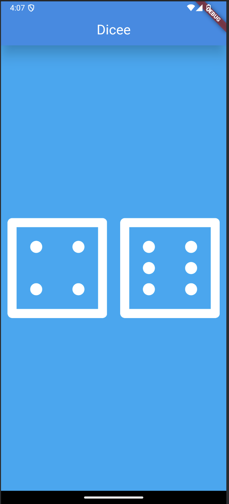

# Dicee 🎲

## My Goal

Hi, I'm Abdellah, and in this project, I developed a simple yet exciting dice rolling app. The main goal was to learn and reinforce key Flutter concepts that will serve as the foundation for creating more complex apps in the future. This project helped me deepen my understanding of state management and how Flutter handles reactive user interfaces.

## What I Created

I built a Las Vegas-style dice app that allows you to roll two dice by pressing a button. It’s a practical tool to settle any decision or simply have fun. Now, I have my own dice app in my pocket for any occasion!



## What I Learned

Throughout the development of this app, I learned the following key concepts and skills:

- **Stateless and Stateful Widgets:** Designing and updating the user interface using these two types of Flutter widgets.
- **State Management with `setState`:** How to mark the widget tree as "dirty" and force updates after a state change.
- **Widget Properties:** Changing colors, sizes, and other attributes to customize the interface.
- **Button Listeners:** Detecting when a button is pressed using `onPressed`.
- **Responsive Design with `Expanded`:** Making widgets automatically adapt to screen dimensions.
- **String Interpolation:** Using dynamic data in text strings easily and effectively.
- **Image Handling:** Adding custom images, such as dice faces, and configuring the app icon.
- **Dart Basics:** From data types to functions and flow control, this project helped me review the basics of the language.

Additionally, I learned how to work with Flutter to customize the app's design, like visually separating the AppBar from the body with shadows or contrast and managing icons for different platforms.

---

### Steps to Clone and Run the Project

1. **Clone the Repository**  
   Open a terminal and run the following command:
   ```bash
   git clone https://github.com/AbdeDevs/dicee_flutter_app.git
   ```

2. **Navigate to the Project Directory**
   ```bash
   cd dicee-flutter-app
   ```

3. **Install Dependencies**  
   Ensure Flutter is installed on your system, then run:
   ```bash
   flutter pub get
   ```

4. **Run the Application**  
   Connect a physical device or start an emulator, then execute the following command:
   ```bash
   flutter run
   ```

5. **Configure Platforms** (optional)  
   If you plan to customize the app for Android or iOS, check the `android` and `ios` folders for platform-specific settings, like package names or permissions.
